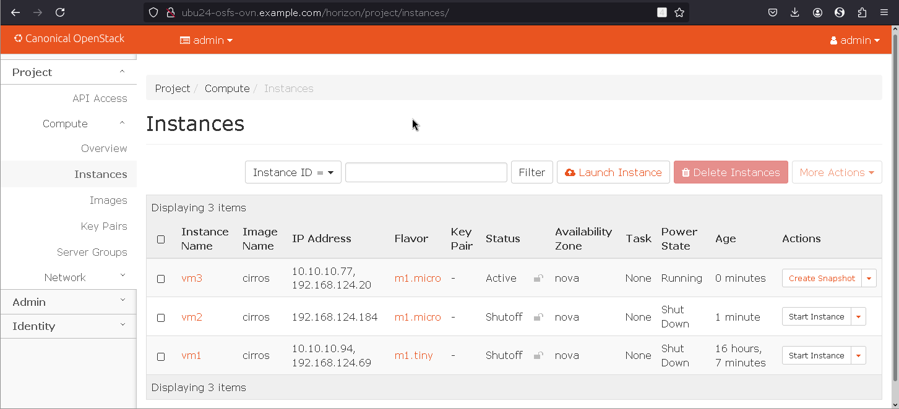

# OpenStack from Scratch (OSFS)

Project summary: setup OpenStack with single and easy to understand bash script.



Here are several variants how to setup single-node OpenStack
under Ubuntu LTS 24.04 (but 1st variant tested under 22.04 only).

# Status

> [!WARNING]
> OpenStack Zed suddenly declared LinuxBridge as "experimental"
> (actually meaning "unsupported").  See
> https://docs.openstack.org/neutron/zed/admin/config-experimental-framework.html
> and https://opendev.org/openstack/kolla-ansible/commit/8ef21123aea6371f23a7e86f6461a91c17bd84fd
> So far, it works.
>
> What is irony that in the past RackSpace run away from OVS back to
> LinuxBridge because OVS was too unstable for regular use:
> https://www.youtube.com/watch?v=_OdPP_4PYD4

All variants (with exception of 1st) use following network setup:

- `eth0` - "Management network", should provide static IP and Internet access for install. On this
  network also listens Web UI called Horizon
- `eth1` - "Provider network", here OpenStack manages IP addresses that can be used
  to reach VMs from outside. This Network should have access to Internet, but *no DHCP server*
  should be there (OpenStack will manage this network with its own DHCP server!)
- there also exists private network for VMs communications called "self-service" network.
  There is no special interface for it. If you have more than 1 Compute host this network
  spans accross these Nodes using tunnel (in my examples VXLAN tunnel).

You can find typical Netplan setup in [etc/netplan/99-openstack.yaml](etc/netplan/99-openstack.yaml).

## Setup script variants

Here are Setup variants with "provider" (public) network only. All examples below
(but 1st one) include also Web UI called Horizon.

1. DEPRECATED: single interface with LinuxBridge - requires lot of trickery to
   make it work. You can find this version under [linuxbridge/](linuxbridge/) -
   tested under Ubuntu 22 LTS. Issues: it requires firewall and Nova patches and
   causes assigned IP addresses mismatches. This example does NOT include Web UI
   Horizon. Only CLI is available.

2. UNSUPPORTED (by OpenStack maintainers) but I like it!: LinuxBridge: 2 network interfaces
   (Management and Provider) with
   LinuxBridge under [linuxbridge-2ifaces/](linuxbridge-2ifaces/). This version
   includes embedded DHCP server and metadata agent (metadata not tested though).
   Tested under Ubuntu 24.04.1 LTS.

3. RECOMMENDED: ML2/OVS: 2 network interfaces (Management and Provider) with Open vSwitch (OVS)
   under [ovs-2ifaces/](ovs-2ifaces/). This version includes embedded DHCP server
   and metadata agent (metadata not tested though). Tested under Ubuntu 24.04.1 LTS.
   Since OpenStack Zed, OVS bridge is only supported bridge in OpenStack deployments (where
   LinuxBridge is "deprecated" and "macvtap" abandoned)

   Now it includes Horizon Web UI

Setup variants with both "provider" (public) and "self-service" (private tenant) networks (typical
OpenStack setup) - all examples below include Horizon Web UI:

4. UNSUPPORTED (by OpenStack maintainers) but I like it!: LinuxBridge: 2 network interfaces
   (Management and Provider/self-service) with
   LinuxBridge under [lbr-full/](lbr-full/). This version
   includes embedded DHCP server metadata agent (metadata not tested though)
   and L3 Agent (required for self-service networks).
   Tested under Ubuntu 24.04.1 LTS.

   It is my preferred solution: LinuxBridge (most straightforward way) with
   both Provider and Self-Service networks.

5. RECOMMENDED: ML2/OVS: 2 network interfaces (Management, Provider) with Open
   vSwitch (OVS) under [ovs-full/](ovs-full/) with self-service network. This
   version includes embedded DHCP server and metadata agent (metadata not tested
   though). Tested under Ubuntu 24.04.1 LTS.  This is most common setup where each
   tenant has its "self-service" network and uses floating IP address to make VMs
   reachable from outside.

6. RECOMMENDED + FUTURE: ML2/OVN with 2 network interfaces (Management, Provider).
   OVN is pushed by OpenStack as future. Scripts are under [ovn/](ovn/). Under hood
   OVS is still there as L2 layer, but "L3 Agents" were replaced with OVN layer.

Disclaimer: I did not yet tested Overlay network - it requires at least 2 compute
nodes. It emulates flat private network (called self-service) for VMs even when
these VMs runs on different Compute Hosts - it is using VXLAN tunnels for this.

> [!NOTE]
> Please ignore `macvtap` version (now under `macvtap-fail/` folder). It seems
> that `macvtap` agent always use VLANs, which is no way in my trivial environment with simple
> home router.

# Debugging tips

Example how to get function, filename and line in log file:

```diff
diff -u /etc/neutron/neutron.conf{.orig,}
--- /etc/neutron/neutron.conf.orig	2023-11-28 16:45:22.876726934 +0000
+++ /etc/neutron/neutron.conf	2023-11-28 16:47:34.727207600 +0000
@@ -444,6 +444,7 @@
 # Format string to use for log messages when context is undefined. Used by
 # oslo_log.formatters.ContextFormatter (string value)
 #logging_default_format_string = %(asctime)s.%(msecs)03d %(process)d %(levelname)s %(name)s [-] %(instance)s%(message)s
+logging_default_format_string = %(asctime)s %(levelname)s %(funcName)s %(pathname)s:%(lineno)d %(name)s [-] %(instance)s%(message)s
 
 # Additional data to append to log message when logging level for the message
 # is DEBUG. Used by oslo_log.formatters.ContextFormatter (string value)
```

And then:

```shell
systemctl stop neutron-server
rm /var/log/neutron/neutron-server.log
systemctl start neutron-server
```

# Why not using DevStack?

1. DevStack install itself from source which is not typical setup (it
   is suitable for OpenStack developers, but not for mere users)
2. In case of failure, the `stack.sh` script is unable to resume - you have to
   start from scratch. It is precarious because most difficult (and most likely to fail) setup is Neutron
   (networking layer) that runs practically at the and of setup.
3. DevStack setup is too sophisticated (by default it uses OVS + OVN which is most
   complicated setup available under Linux ever)
4. I was unable to setup it properly with plain LinuxBridge and/or
   plain Macvtap (suspecting that documentation is outdated in that case).
